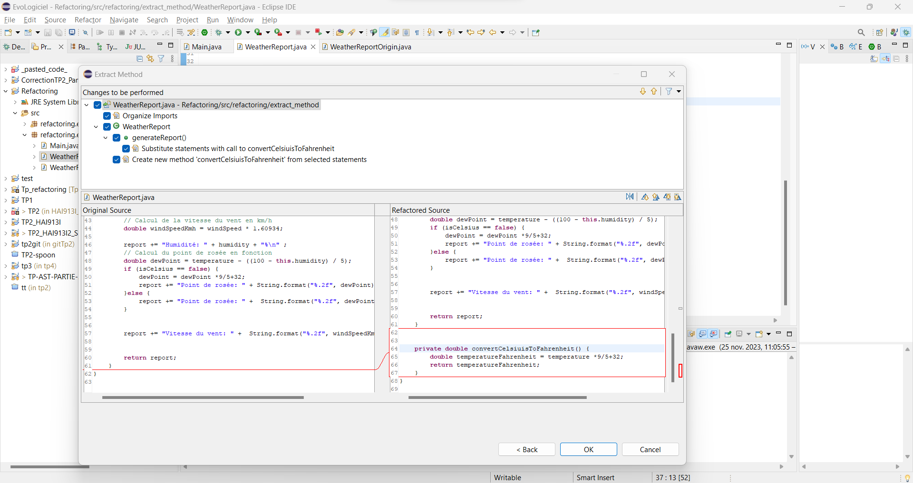

# Rapport TP Refactoring

Etienne Martin-Chantereau
Loum Maniang

Nous allons présenter les deux opérations de refactoring suivantes :

- Extract method
- Extract class

Pour chacune des deux opérations à réaliser vous trouverez en suivant :

1.  Une présentation du programme avec sa fonction main, le défaut de l'application
2.  L'explication de l'opération de refactoring réalisée
3.  Une copie des écrans des différentes étapes de refactoring sous eclipses
4.  Notre avis sur l'intérêt de l'opération et sur sa mise en oeuvre su eclipse
5.  Comment s'est déroulé le test
6.  Le programme une fois réfactoré
7.  Le test de chatGPT avec l'analyse de ses résultats.

# Sommaire

- [Rapport TP Refactoring](#rapport-tp-refactoring)
- [Sommaire](#sommaire)
- [1. Extract Method](#1-extract-method)
  - [1.1 Présentation du programme et défaut de l'application](#11-présentation-du-programme-et-défaut-de-lapplication)
    - [1.1.1 Présentation du programme et défaut de l'application](#111-présentation-du-programme-et-défaut-de-lapplication)
    - [1.1.2 Présentation du défaut de l'application](#112-présentation-du-défaut-de-lapplication)
  - [1.2 Explication de l'opération de refactoring Extract Method](#12-explication-de-lopération-de-refactoring-extract-method)
  - [1.3 Copie des écrans des étapes de refactoring sur Eclipse](#13-copie-des-écrans-des-étapes-de-refactoring-sur-eclipse)
  - [1.4 Avis sur l'intérêt de l'opération et sur sa mise en oeuvre sous eclipse](#14-avis-sur-lintérêt-de-lopération-et-sur-sa-mise-en-oeuvre-sous-eclipse)
  - [1.5 Déroulement du test](#15-déroulement-du-test)
  - [1.6 Programme refactoré](#16-programme-refactoré)
    - [1.6.1 Programme refactoré par Eclipse :](#161-programme-refactoré-par-eclipse-)
    - [1.6.2 Programme refactoré à l'aide d'Eclipse et manuellement :(ce que l'on aurait souhaité obtenir)](#162-programme-refactoré-à-laide-declipse-et-manuellement-ce-que-lon-aurait-souhaité-obtenir)
  - [1.7 Question 3 - Test de ChatGPT](#17-question-3---test-de-chatgpt)
  - [1.7.1 Prompt de ChatGPT](#171-prompt-de-chatgpt)
  - [1.7.2 Analyse des résultats obtenus](#172-analyse-des-résultats-obtenus)
- [2. Extract Class](#2-extract-class)
  - [1.1 Présentation du programme et défaut de l'application](#11-présentation-du-programme-et-défaut-de-lapplication-1)
    - [1.1.1 Présentation du programme](#111-présentation-du-programme)
    - [1.1.2 Présentation du défaut de l'application](#112-présentation-du-défaut-de-lapplication-1)
  - [1.2 Explication de l'opération de refactoring Extract Class](#12-explication-de-lopération-de-refactoring-extract-class)
  - [1.3 Copie des écrans des étapes de refactoring sur Eclipse](#13-copie-des-écrans-des-étapes-de-refactoring-sur-eclipse-1)
  - [1.4 Avis sur l'intérêt de l'opération et sur sa mise en oeuvre sous eclipse](#14-avis-sur-lintérêt-de-lopération-et-sur-sa-mise-en-oeuvre-sous-eclipse-1)
  - [1.5 Déroulement du test](#15-déroulement-du-test-1)
  - [1.6 Programme refactoré](#16-programme-refactoré-1)
    - [1.6.1 État du programme avant l'opération move sur les méthodes :](#161-état-du-programme-avant-lopération-move-sur-les-méthodes-)
    - [1.6.2 État du programme après l'opération move sur les méthodes concernées :](#162-état-du-programme-après-lopération-move-sur-les-méthodes-concernées-)
    - [1.6.3 Programme refactoré avec Eclipse et avec l'aide manuel (ce que l'on aurait souhaité obtenir)](#163-programme-refactoré-avec-eclipse-et-avec-laide-manuel-ce-que-lon-aurait-souhaité-obtenir)
  - [1.7 Question 3 - Test de ChatGPT](#17-question-3---test-de-chatgpt-1)
  - [1.7.1 Prompt de ChatGPT](#171-prompt-de-chatgpt-1)
  - [1.7.2 Analyse des résultats obtenus](#172-analyse-des-résultats-obtenus-1)
- [Étude de l'opération de refactoring Extract Interface](#étude-de-lopération-de-refactoring-extract-interface)
  - [Question 1 Appliquer l'opération de refactoring](#question-1-appliquer-lopération-de-refactoring)
  - [Question 2 factorisation ou duplication](#question-2-factorisation-ou-duplication)
  - [Question 3](#question-3)

# 1. Extract Method

## 1.1 Présentation du programme et défaut de l'application

### 1.1.1 Présentation du programme et défaut de l'application

Le programme est constitué d'une classe unique et d'un main, la classe WeatherReport permet de générer un rapport météorologique
grâce à la méthode generateReport en fonction des paramètres passée à l'objet lors de l'appel du constructeur.
La classe generateReport permet notamment de modifier la valeur de la température et de le point de rosée (valeur approchée) en fonction de si celle-ci doit être générée en celsius ou en fahrenheit. Ainsi que calculer la vitesse du vent.

```java
package refactoring.extract_method;

public class WeatherReport {

	private double temperature;
	private boolean isCelsius;
	private double windSpeed;
	private double humidity;

	public WeatherReport(double temperature, boolean isCelsius, double windSpeed, double humidity) {
		this.temperature = temperature;
		this.windSpeed = windSpeed;
		this.humidity = humidity;
		this.isCelsius = isCelsius;
	}


	public boolean isCelsius() {
		return isCelsius;
	}


	public void setCelsius(boolean isCelsius) {
		this.isCelsius = isCelsius;
	}


	public String generateReport() {

		String report = "Weather Report\n";

		// Calcul de l'indice de chaleur
		if(isCelsius == false) {

			Double temperatureFahrenheit = temperature *9/5+32;
			report += "Température: " +  String.format("%.2f", temperatureFahrenheit)  + "°F\n";
		}else {
			report += "Température: " + String.format("%.2f", temperature) + "°C\n";
		}

		// Calcul de la vitesse du vent en km/h
		double windSpeedKmh = windSpeed * 1.60934;

		report += "Humidité: " + humidity + "%\n" ;
		// Calcul du point de rosée en fonction
		double dewPoint = temperature - ((100 - this.humidity) / 5);
		if (isCelsius == false) {
			dewPoint = dewPoint *9/5+32;
			report += "Point de rosée: " + String.format("%.2f", dewPoint) + "°F\n";
		}else {
			report += "Point de rosée: " +  String.format("%.2f", dewPoint) + "°C\n";
		}


		report += "Vitesse du vent: " +  String.format("%.2f", windSpeedKmh) + " km/h\n";


		return report;
	}
}
```

La classe Main est constituée de la création de d'un objet Weather avec son appel à constructeur puis on vient afficher dans la console le rapport météorologique en Celsius puis en Fahrenheit
générant un rapport en

```java
package refactoring.extract_method;

public class Main {

	public static void main(String[] args) {

		WeatherReport todayWeather = new WeatherReport(15, false, 20, 67);
		System.out.println(todayWeather.generateReport());

		todayWeather.setCelsius(true);
		System.out.println(todayWeather.generateReport());

	}

}
```

### 1.1.2 Présentation du défaut de l'application

Le défaut de l'application se trouve dans la méthode generateRapport qui consiste en une seule fonctionnalité à la fois de calcul de conversion et de génération de string.
Nous perdons ainsi en maintenabilitée du code car il faut venir modifier la fonction entière pour l'impacter.
Aussi cela nous fait perdre de la modularité car nous pourrions vouloir juste effectuer un changement de température sans générer forcément un rapport, en extrayant des sous méthode du code de generateReport il sera possible d'effectuer cette opération.
Enfin la méthode ne respecte pas le principe SOLID notamment le Single responsibility principle qui veut qu'une classe ou fonction doit avec une seule unique raison d'être modifiée et une seule fonctionnalité. Or ici elle gère à la fois le calcul et la génération des rapports. La méthode peut donc être modifiée si on veut modifiée les calculs ou modifiée la string à afficher.
Ceci nous fait donc perdre en lisibilitée du code.

## 1.2 Explication de l'opération de refactoring Extract Method

L'extraction de méthode est une opération de refactoring qui permet d'extraire une ou plusieurs fonctionnalité d'une méthode longue et complexe d'origine.
Cela permet d'augmenter la lisibilitée de la méthode d'origine et d'éviter la duplication de code.
En venant décomposée la méthode d'origine par des sous méthodes, l'extraction de méthodes rends l'ensemble du code et de ses composantes plus maitenable.

Le processus peut s'effectuer en 4 étapes :

1. Identifier le code à extraire de la méthode complexe
2. Écrire ou générer à l'aide d'un ide une méthode correspondant à la partie du code à extraire, en passant si besoin les variables locales et paramètres nécessaires.
3. Modifier la méthode d'origine en appelant la nouvelle méthode
4. Tester la méthode d'origine et la méthode créée.

## 1.3 Copie des écrans des étapes de refactoring sur Eclipse





## 1.4 Avis sur l'intérêt de l'opération et sur sa mise en oeuvre sous eclipse

L'opération d'extraction de méthode a pour nous un réel intérêt pour décomposer le code et améliorer sa testabilitée.
En effet elle permet de découper un problème complexe (méthode) de taille N en sous problème plus simple de taille n-1. Ces derniers étant plus simple à tester améliorant la testabilitée de l'ensemble de la classe et de la méthode complexe du fait du couplage avec cette dernière.  
En testant les petites fonction nous pouvons alors nous assurer que leur regroupement fonctionne.
En plus de ce bénéfice d'une meilleure maintenance l'opération d'extraction de méthode permet d'améliorer sa structure interne sans en changer son fonctionnement extérieure.
Aussi la création de méthode réutilisable permet d'améliorer la modularité car ces dernières peuvent être maintenues et améliorer en cas de besoin.
Enfin de manière générale l'opération de refactoring et d'extraction de méthode s'intègre totalement dans les principes de la programmation modulaire et du TDD (Test Driven Development).
Ces derniers sont pour nous sont parmi les meilleurs approches de développement logiciels par leur approche rigoureuse et modulaire

En ce qui concerne la mise en oeuvre sur eclipse, notre avis est mitigé. D'un côté l'extraction est efficace est permet de générer du code sans destructuré la classe et la susdite méthode visée.
Toutefois le code extrait et sa génération dépend vraiment de notre sélection, il y a donc un gros travail d'analyse en amont avant de pouvoir générer l'opération de refactoring car en rajoutant ou enlevant une ligne de l'ensemble à extraire le résultat diffère beaucoup.
Cette imprécision est d'autant plus flagrante que lors de la génération du code, le fichier n'est pas réanalyser pour supprimer automatiquemnt les méthodes similaire.

Par exemple c'est le cas dans la vidéo où nous refactorons la méthode <b>string.format</b>. Il est regrettable de voir que toutes les méthodes ayant un strin.format n'est pas été modifiée en simultanée.
Et lorsque nous souhaitons refactorée les susdits lignes une à une, eclipse ne nous propose pas le code précédemment générée. (CF vidéo)

## 1.5 Déroulement du test

Le test c'est correctement effectué après que l'opération de refactoring. Nous n'avons pas eu besoin de changer le main car les méthodes extraites n'ont pas impacté la structure du code de la méthode.

## 1.6 Programme refactoré

Dans cette partie vous trouverez le code refactoré et un exemple du code que nous aurions aimé retrouvé après l'opération de refactoring. Cet exemple a été réalisé afin d'appuyer nos propos 1.4

### 1.6.1 Programme refactoré par Eclipse :

```Java
package refactoring.extract_method;

public class WeatherReport {

	private double temperature;
	private boolean isCelsius;
	private double windSpeed;
	private double humidity;

	public WeatherReport(double temperature, boolean isCelsius, double windSpeed, double humidity) {
		this.temperature = temperature;
		this.windSpeed = windSpeed;
		this.humidity = humidity;
		this.isCelsius = isCelsius;
	}


	public boolean isCelsius() {
		return isCelsius;
	}


	public void setCelsius(boolean isCelsius) {
		this.isCelsius = isCelsius;
	}


	public String generateReport() {

		String report = "Weather Report\n";

		Double temperatureFahrenheit = 0.0;

		report = temperatureReport(report);

		// Calcul de la vitesse du vent en km/h
		double windSpeedKmh = windSpeedToKilometer();

		report = dewReport(report);


		report += "Vitesse du vent: " +  String.format("%.2f", windSpeedKmh) + " km/h\n";


		return report;
	}


	private String dewReport(String report) {
		report += "Humidité: " + humidity + "%\n" ;
		// Calcul du point de rosée en fonction
		double dewPoint = calculateDewPoint();
		if (isCelsius == false) {
			dewPoint = dewPoint *9/5+32;
			report += "Point de rosée: " + String.format("%.2f", dewPoint) + "°F\n";
		}else {
			report += "Point de rosée: " +  String.format("%.2f", dewPoint) + "°C\n";
		}
		return report;
	}


	private String temperatureReport(String report) {
		Double temperatureFahrenheit;
		// Calcul de l'indice de chaleur
		if(isCelsius == false) {

			temperatureFahrenheit = convertCelsiusToFahrenheit();
			report += "Température: " +  format2f(temperatureFahrenheit)  + "°F\n";
		}else {
			report += "Température: " + String.format("%.2f", temperature )+ "°C\n";
		}
		return report;
	}


	private double calculateDewPoint() {
		double dewPoint = temperature - ((100 - this.humidity) / 5);
		return dewPoint;
	}


	private double windSpeedToKilometer() {
		double windSpeedKmh = windSpeed * 1.60934;
		return windSpeedKmh;
	}


	private String format2f(Double weatherData) {
		return String.format("%.2f", weatherData);
	}


	private Double convertCelsiusToFahrenheit() {
		Double temperatureFahrenheit;
		temperatureFahrenheit = temperature *9/5+32;
		return temperatureFahrenheit;
	}
}
```

### 1.6.2 Programme refactoré à l'aide d'Eclipse et manuellement :(ce que l'on aurait souhaité obtenir)

```Java
package refactoring.extract_method;

public class WeatherReportMe {

	private double temperature;
	private boolean isCelsius;
	private double windSpeed;
	private double humidity;

	public WeatherReportMe(double temperature, boolean isCelsius, double windSpeed, double humidity) {
		this.temperature = temperature;
		this.windSpeed = windSpeed;
		this.humidity = humidity;
		this.isCelsius = isCelsius;
	}


	public boolean isCelsius() {
		return isCelsius;
	}


	public void setCelsius(boolean isCelsius) {
		this.isCelsius = isCelsius;
	}


	public String generateReport() {

		String report = "Weather Report\n";
		double dewPoint = calculateDewPoint();
		String unitTemperature = "°C";
		// Calcul de l'indice de chaleur
		report += "Température: ";
		if(isCelsius == false) {
			unitTemperature = "°F";
			report += format2f(convertCelsiusToFahrenheit(temperature));
			dewPoint = convertCelsiusToFahrenheit(dewPoint);
		}else {
			report += format2f(temperature);
		}
		report += unitTemperature + "\n";
		report += "Humidité: " + humidity + "%\n" ;
		report += "Point de rosée: " + dewPoint + unitTemperature +"\n";
		report += "Vitesse du vent: " +  String.format("%.2f", windSpeedToKilometer()) + " km/h\n";


		return report;
	}


	private String format2f(Double weatherData) {
		return String.format("%.2f", weatherData);
	}

	private Double convertCelsiusToFahrenheit(double temperature) {
		double temperatureFahrenheit = temperature *9/5+32;
		return temperatureFahrenheit;
	}

	// Calcul de la vitesse du vent en km/h
	private double windSpeedToKilometer() {
		double windSpeedKmh = windSpeed * 1.60934;
		return windSpeedKmh;
	}

	private double calculateDewPoint() {
		double dewPoint = temperature - ((100 - this.humidity) / 5);
		return dewPoint;
	}
}
```

## 1.7 Question 3 - Test de ChatGPT

## 1.7.1 Prompt de ChatGPT

## 1.7.2 Analyse des résultats obtenus

Dans cette série de prompt à l'inverse du cas de l'extract class nous avons laissé place à l'IA pour quel génère et prenne des décisions dans la manière de réecrire le code.
En n'ayant seulement le contexte et pas d'instruction précise nous remarquons que nos résultas sont efficient que les résultats de la prochaine opération de refactoring.
En effet il nous a fallu plus de prompt pour parvenir à un résultat effiace, le modèle ayant parfois insérer des coquilles d'appels de méthode inutile qu'il aurait pu synthétiser en une seule ou éviter de l'appeler.
Nous avons donc eu besoin ici de le calibrer à chaque nouveau prompt pour supprimer une erreur après l'autre pour arriver à notre résultat finale.

Les résultats sont donc très différents de ce que nous attendions notamment par l'utilisation d'un string builder plutôt qu'une concaténation.
Ceci vient prendre donc un autre paramètre en compte indirecte l'efficience du code car un string builder est beaucoup plus rapide qu'une concaténation sur une échelle de donnée + large.
Ainsi bien que différent que ceux attendu les résultats nous offre une nouvelle perspective de refactoring des méthodes, tout ou même plus pertinente que celle que nous avions proprosés.

# 2. Extract Class

## 1.1 Présentation du programme et défaut de l'application

### 1.1.1 Présentation du programme

Le programme est constitué d'une classe Voiture et d'un main, la classe Voiture représente un objet physique voiture. Elle possède les attributs suivants :

- Une marque
- Une modèle
- Une numéro d'immatriculation
- Un prix TTC
- Une compagnie d'assurance
- Un numéro d'assurance (numéro du contrat)
- Une date d'expiration du contrat.

Elle possède plusieurs méthode relatif outre les getters setters dont une méthode prixHT permettant de générer le prix Hors Taxe de la voiture (TVA de 20% sur les véhicules français).
Ainsi qu'une méthode testant la validité de l'assurance en comparant la date d'aujourd'hui et la date d'expiration, une méthode affichant les jours restant formatée sous forme de string à travers la méthode formatPeriode.

```Java
package refactoring.extract_classes;

import java.time.LocalDate;
import java.time.Period;

public class Voiture {

	private String marque;
	private String modele;
	private String numeroImmatriculation;
	private float prixTTC;
	// Attributs relatifs à l'assurance
	private String compagnieAssurance;
	private String numeroAssurance;
	private LocalDate dateExpiration;

	// Constructeur

	public Voiture(String marque, String modele, String numeroImmatriculation, float prixTTC, String compagnieAssurance,
			String numeroAssurance, LocalDate dateExpiration) {
		super();
		this.marque = marque;
		this.modele = modele;
		this.numeroImmatriculation = numeroImmatriculation;
		this.prixTTC = prixTTC;
		this.compagnieAssurance = compagnieAssurance;
		this.numeroAssurance = numeroAssurance;
		this.dateExpiration = dateExpiration;
	}


	//Méthode liées à la voiture

	public String getMarque() {
		return marque;
	}

	public void setMarque(String marque) {
		this.marque = marque;
	}


	public String getModele() {
		return modele;
	}


	public void setModele(String modele) {
		this.modele = modele;
	}


	public String getNumeroImmatriculation() {
		return numeroImmatriculation;
	}

	public float getPrixTTC() {
		return prixTTC;
	}

	public void setPrixTTC(float prixTTC) {
		this.prixTTC = prixTTC;
	}

	public float prixHT() {
		return (float) (prixTTC * 0.80);
	}

	//Méthode de l'assurance
	public void setNumeroImmatriculation(String numeroImmatriculation) {
		this.numeroImmatriculation = numeroImmatriculation;
	}


	public String getCompagnieAssurance() {
		return compagnieAssurance;
	}


	public void setCompagnieAssurance(String compagnieAssurance) {
		this.compagnieAssurance = compagnieAssurance;
	}


	public String getNumeroAssurance() {
		return numeroAssurance;
	}


	public void setNumeroAssurance(String numeroAssurance) {
		this.numeroAssurance = numeroAssurance;
	}


	public LocalDate getDateExpiration() {
		return dateExpiration;
	}


	public void setDateExpiration(LocalDate nouvelleDateExpiration) {
		if(nouvelleDateExpiration.isAfter(dateExpiration))
			this.dateExpiration = nouvelleDateExpiration;
	}

	public boolean estAssuranceValide() {
		LocalDate aujourdHui = LocalDate.now();
		return dateExpiration != null && aujourdHui.isBefore(dateExpiration);
	}

    public String joursAvantExpiration() {
        LocalDate aujourdHui = LocalDate.now();
        if (dateExpiration != null && !aujourdHui.isAfter(dateExpiration)) {
            Period periode = Period.between(aujourdHui, dateExpiration);
            return formatPeriode(periode);
        } else {
            return "L'assurance est déjà expirée ou la date d'expiration n'est pas définie.";
        }
    }

    private String formatPeriode(Period periode) {
        return periode.getYears() + " année(s), " + periode.getMonths() + " mois, et " + periode.getDays() + " jour(s)";
    }

	@Override
	public String toString() {
		return "Voiture : \n[marque=" + marque + ",\n modele=" + modele + ",\n numeroImmatriculation=" + numeroImmatriculation
				+ ",\n prixTTC=" + prixTTC + "€,\n compagnieAssurance=" + compagnieAssurance + ",\n numeroAssurance="
				+ numeroAssurance + ",\n dateExpiration=" + dateExpiration + "]";
	}

}
```

Le programme est appelée à travers la classe Main instanciant un objet Voiture puis venant appelée chacune des méthodes principales de la classe twingo.

```java

package refactoring.extract_classes;
import java.time.LocalDate;

public class Main {
    public static void main(String[] args) {
    	Voiture twingo = new Voiture("Renault", "Twingo", "BW-025-AE", 25000 ,"GMF", "097KEZR", LocalDate.of(2025, 02, 02));
    	System.out.println("Quel est le prix Hors Taxe de la twingo ? : "+ twingo.prixHT() + "€");
    	System.out.println("L'assurance de la twingo est elle valide ?  : " + twingo.estAssuranceValide());
    	System.out.println("Dans combien de temps expire l'assurance de la twingo ? : " + twingo.joursAvantExpiration());
    	System.out.println(twingo);

    }
}
```

### 1.1.2 Présentation du défaut de l'application

Le défaut de l'application est dans la construction de la classe Voiture en effet celle-ci représente à la fois la conception d'une voiture et dans sa vision arrondie l'assurance ou tout du moins (le contrat d'assurance) reliée à la voiture.
La classe a donc deux responsaiblitée une pour la voiture, une pour l'assurance. Ceci est est contraire au principe de Single Responsability (SOLID) précédemment présentée.
En effet le programme général vient perdre de l'abstraction car un objet informatisée en représente deux physiques alors que ceux-ci sont couplés et non un seul concept.
Il en découle une perte de maintenabilitée du code car si nous souhaitons modifier, rajouter, supprimer une fonctionnalité sur l'assurance il faudra modifier la classe voiture dans son intégralité et vice-versa.
Il serait donc nécessaire la classe contrat d'assurance voiture de la classe Voiture pour pouvoir rendre chacun des objets responsable d'eux même.

## 1.2 Explication de l'opération de refactoring Extract Class

L'extraction de classe est une opération de refactoring qui permet d'extraire d'une classe d'origine devenu trop complexe ou mal programmé.
L'objectif ici est de crée une nouvelle classe en déplaçant certaines méthodes et données (fonctionnalitée) à cette dernière.
Cela permet de respecter le principe de Single Responsability (SOLID), une classe a une seule responsabilitée, un seul objectif.  
Faciliter la maintenance du code en réduisant la responsabilitée d'une classe.
Cela permet de réduire la complexité du code chaque classe créée n'ayant qu'une responsabilitée unique.

Le processus peut s'effectuer en 4 étapes :

1. Identifier les fonctionnalitées à extraire de la classe d'origine
2. Écrire ou générer à l'aide d'un ide la nouvelle classe avec les fonctionnalitées ciblées.
3. Modifier la classe d'origine en appelant la nouvelle classe au sein de celle-ci. Notamment dans les méthodes utilisant les propriétés de la nouvelle classes
4. Tester la classe d'origine et la classe créée.

## 1.3 Copie des écrans des étapes de refactoring sur Eclipse


<video src="extract_class_finish.mp4" controls title="
"></video>

<video src="20231127-1559-16.4231867.mp4" controls title="

"></video>

## 1.4 Avis sur l'intérêt de l'opération et sur sa mise en oeuvre sous eclipse

L'opération extract class partage plusieurs avantages précédemment mentionnées pour l'extract méthode comme : la réduction du compte, l'augmentation de la maintenabilitée du programme, le respect du principe de Single Responsability etc...

De manière plus spécifique l'extraction de classe permet d'améliorer la modularité non pas d'une classe (extract method) mais de l'application entière car une classe nouvellement créée pourra être réutiliser à d'autre endroit de l'application.

Quand à sa mise en oeuvre sous eclipse celle-ci est moins efficace qu'extract method.
En effet nous déplorons que nous ne puissions pas sélectionner les méthodes de la classe originelle à la nouvelle classe.
Cette action est pourtant possible avec l'extraction de super class.
Cela nous oblige donc à opérer une tâche nécessaire de déplacement du code de la classe d'origine correspondant à la nouvelle classe.

Aussi il est dommage de ne pas pouvoir crée un nouveau constructeur avec une méthode recevant un objet de la classe nouvellement créée.
Au lieu de cela les setters de la nouvelle classe sont utilisée pour instancier un objet du type de la nouvelle en classe.

En somme, en ne déplaçant pas les méthodes vers la nouvelle classe d'origine, en modifiant pas le constructeur par l'ajout d'un paramètre du type de la nouvelle classe, la classe d'origine reste indirectement avec plusieurs responsabilitée. Dans le cas où aucune nouvelle opération de refactoring ne sauraient ajoutées.
ec

## 1.5 Déroulement du test

Nous aurions pu faire fonctionner le test correctement sans changer le code en ne déplaçant pas les méthodes après la création de la nouvelle classe.
Toutefois l'objectif ici comme nous l'avions indiqué dans notre avis est de retirer la responsabilitée et donc de migrer toutes les méthodes concernant la nouvelle classe vers cette dernière.
De ce fait il a fallu réaliser un getter sur ce nouvel attribut afin d'appeler les méthodes déplacer.
Sans ce déplacement des méthodes nous n'aurions pas eu à changer le main, mais l'opération de refactoring n'aurait pas retirer la responsabilitée de la classe voiture.

## 1.6 Programme refactoré

### 1.6.1 État du programme avant l'opération move sur les méthodes :

```Java

package refactoring.extract_classes;

import java.time.LocalDate;

public class ContratAssuranceVoiture {
	public String compagnieAssurance;
	public String numeroAssurance;
	public LocalDate dateExpiration;

	public ContratAssuranceVoiture() {
	}
}

```

```Java
package refactoring.extract_classes;

import java.time.LocalDate;
import java.time.Period;

public class Voiture {

	private String marque;
	private String modele;
	private String numeroImmatriculation;
	private float prixTTC;
	private ContratAssuranceVoiture contratAssurance = new ContratAssuranceVoiture();


	// Constructeur

	public Voiture(String marque, String modele, String numeroImmatriculation, float prixTTC, String compagnieAssurance,
			String numeroAssurance, LocalDate dateExpiration) {
		super();
		this.marque = marque;
		this.modele = modele;
		this.numeroImmatriculation = numeroImmatriculation;
		this.prixTTC = prixTTC;
		this.contratAssurance.compagnieAssurance = compagnieAssurance;
		this.contratAssurance.numeroAssurance = numeroAssurance;
		this.contratAssurance.dateExpiration = dateExpiration;
	}


	//Méthode liées à la voiture

	public String getMarque() {
		return marque;
	}

	public void setMarque(String marque) {
		this.marque = marque;
	}


	public String getModele() {
		return modele;
	}


	public void setModele(String modele) {
		this.modele = modele;
	}


	public String getNumeroImmatriculation() {
		return numeroImmatriculation;
	}

	public float getPrixTTC() {
		return prixTTC;
	}

	public void setPrixTTC(float prixTTC) {
		this.prixTTC = prixTTC;
	}

	public float prixHT() {
		return (float) (prixTTC * 0.80);
	}

	//Méthode de l'assurance
	public void setNumeroImmatriculation(String numeroImmatriculation) {
		this.numeroImmatriculation = numeroImmatriculation;
	}


	public String getCompagnieAssurance() {
		return contratAssurance.compagnieAssurance;
	}


	public void setCompagnieAssurance(String compagnieAssurance) {
		this.contratAssurance.compagnieAssurance = compagnieAssurance;
	}


	public String getNumeroAssurance() {
		return contratAssurance.numeroAssurance;
	}


	public void setNumeroAssurance(String numeroAssurance) {
		this.contratAssurance.numeroAssurance = numeroAssurance;
	}


	public LocalDate getDateExpiration() {
		return contratAssurance.dateExpiration;
	}


	public void setDateExpiration(LocalDate nouvelleDateExpiration) {
		if(nouvelleDateExpiration.isAfter(contratAssurance.dateExpiration))
			this.contratAssurance.dateExpiration = nouvelleDateExpiration;
	}

	public boolean estAssuranceValide() {
		LocalDate aujourdHui = LocalDate.now();
		return contratAssurance.dateExpiration != null && aujourdHui.isBefore(contratAssurance.dateExpiration);
	}

    public String joursAvantExpiration() {
        LocalDate aujourdHui = LocalDate.now();
        if (contratAssurance.dateExpiration != null && !aujourdHui.isAfter(contratAssurance.dateExpiration)) {
            Period periode = Period.between(aujourdHui, contratAssurance.dateExpiration);
            return formatPeriode(periode);
        } else {
            return "L'assurance est déjà expirée ou la date d'expiration n'est pas définie.";
        }
    }

    private String formatPeriode(Period periode) {
        return periode.getYears() + " année(s), " + periode.getMonths() + " mois, et " + periode.getDays() + " jour(s)";
    }

	@Override
	public String toString() {
		return "Voiture : \n[marque=" + marque + ",\n modele=" + modele + ",\n numeroImmatriculation=" + numeroImmatriculation
				+ ",\n prixTTC=" + prixTTC + "€,\n compagnieAssurance=" + contratAssurance.compagnieAssurance + ",\n numeroAssurance="
				+ contratAssurance.numeroAssurance + ",\n dateExpiration=" + contratAssurance.dateExpiration + "]";
	}

}
```

Main inchangé.

### 1.6.2 État du programme après l'opération move sur les méthodes concernées :

```Java
package refactoring.extract_classes;

import java.time.LocalDate;
import java.time.Period;

public class ContratAssuranceVoiture {
	public String compagnieAssurance;
	public String numeroAssurance;
	public LocalDate dateExpiration;

	public ContratAssuranceVoiture() {
	}

	//Méthode de l'assurance

	public String getCompagnieAssurance() {
		return compagnieAssurance;
	}


	public void setCompagnieAssurance(String compagnieAssurance) {
		this.compagnieAssurance = compagnieAssurance;
	}


	public String getNumeroAssurance() {
		return numeroAssurance;
	}


	public void setNumeroAssurance(String numeroAssurance) {
		this.numeroAssurance = numeroAssurance;
	}


	public LocalDate getDateExpiration() {
		return dateExpiration;
	}


	public void setDateExpiration(LocalDate nouvelleDateExpiration) {
		if(nouvelleDateExpiration.isAfter(dateExpiration))
			dateExpiration = nouvelleDateExpiration;
	}

	public boolean estAssuranceValide() {
		LocalDate aujourdHui = LocalDate.now();
		return dateExpiration != null && aujourdHui.isBefore(dateExpiration);
	}

    public String joursAvantExpiration() {
        LocalDate aujourdHui = LocalDate.now();
        if (dateExpiration != null && !aujourdHui.isAfter(dateExpiration)) {
            Period periode = Period.between(aujourdHui, dateExpiration);
            return formatPeriode(periode);
        } else {
            return "L'assurance est déjà expirée ou la date d'expiration n'est pas définie.";
        }
    }

    private String formatPeriode(Period periode) {
        return periode.getYears() + " année(s), " + periode.getMonths() + " mois, et " + periode.getDays() + " jour(s)";
    }

}
```

Classe Voiture

```Java
package refactoring.extract_classes;

import java.time.LocalDate;
import java.time.Period;

public class Voiture {

	private String marque;
	private String modele;
	private String numeroImmatriculation;
	private float prixTTC;
	private ContratAssuranceVoiture contratAssurance = new ContratAssuranceVoiture();


	// Constructeur

	public Voiture(String marque, String modele, String numeroImmatriculation, float prixTTC, String compagnieAssurance,
			String numeroAssurance, LocalDate dateExpiration) {
		super();
		this.marque = marque;
		this.modele = modele;
		this.numeroImmatriculation = numeroImmatriculation;
		this.prixTTC = prixTTC;
		this.contratAssurance.compagnieAssurance = compagnieAssurance;
		this.contratAssurance.numeroAssurance = numeroAssurance;
		this.contratAssurance.dateExpiration = dateExpiration;
	}


	//Méthode liées à la voiture

	public String getMarque() {
		return marque;
	}

	public void setMarque(String marque) {
		this.marque = marque;
	}


	public String getModele() {
		return modele;
	}


	public void setModele(String modele) {
		this.modele = modele;
	}


	public String getNumeroImmatriculation() {
		return numeroImmatriculation;
	}

	public void setNumeroImmatriculation(String numeroImmatriculation) {
		this.numeroImmatriculation = numeroImmatriculation;
	}

	public float getPrixTTC() {
		return prixTTC;
	}

	public void setPrixTTC(float prixTTC) {
		this.prixTTC = prixTTC;
	}

	public float prixHT() {
		return (float) (prixTTC * 0.80);
	}


	public ContratAssuranceVoiture getContratAssurance() {
		return contratAssurance;
	}


	public void setContratAssurance(ContratAssuranceVoiture contratAssurance) {
		this.contratAssurance = contratAssurance;
	}


	@Override
	public String toString() {
		return "Voiture : \n[marque=" + marque + ",\n modele=" + modele + ",\n numeroImmatriculation=" + numeroImmatriculation
				+ ",\n prixTTC=" + prixTTC + "€,\n compagnieAssurance=" + contratAssurance.compagnieAssurance + ",\n numeroAssurance="
				+ contratAssurance.numeroAssurance + ",\n dateExpiration=" + contratAssurance.dateExpiration + "]";
	}

}

```

Classe Main :

```Java
package refactoring.extract_classes;
import java.time.LocalDate;

public class Main {
    public static void main(String[] args) {
    	Voiture twingo = new Voiture("Renault", "Twingo", "BW-025-AE", 25000 ,"GMF", "097KEZR", LocalDate.of(2025, 02, 02));
    	System.out.println("Quel est le prix Hors Taxe de la twingo ? : "+ twingo.prixHT() + "€");
    	System.out.println("L'assurance de la twingo est elle valide ?  : " + twingo.getContratAssurance().estAssuranceValide());
    	System.out.println("Dans combien de temps expire l'assurance de la twingo ? : " + twingo.getContratAssurance().joursAvantExpiration());
    	System.out.println(twingo);

    }
}
```

### 1.6.3 Programme refactoré avec Eclipse et avec l'aide manuel (ce que l'on aurait souhaité obtenir)

Nous n'allons pas réecrire le programme dans son intégralité comme pour l'extract méthode nous allons présentée les éléments que nous aurions souhaité voir apparaitre dans la classe Voiture. En plus du déplacement automatique des méthodes impliquées dans la classe contrat assurance nous aurions aimée voir apparaitre après le refactoring :

- Une méthode toString faisant appel à la méthode toString de la classe ContratAssurance
- Un constructeur prenant en paramètre un objet de type ContratAssuranceVoiture.

```Java
	public Voiture(String marque, String modele, String numeroImmatriculation, float prixTTC,
			ContratAssuranceVoiture contratAssurance) {
		super();
		this.marque = marque;
		this.modele = modele;
		this.numeroImmatriculation = numeroImmatriculation;
		this.prixTTC = prixTTC;
		this.contratAssurance = contratAssurance;
	}


	@Override
	public String toString() {
		return "Voiture [marque=" + marque + ", modele=" + modele + ", numeroImmatriculation=" + numeroImmatriculation
				+ ", prixTTC=" + prixTTC + ", contratAssurance=" + contratAssurance + "]";
	}
```

Dans la classe ContratAssuranceVoiture un constructeur par défaut utilisant tout les champs au lieu de seulement le constructeur vide.
Les getter et setter comme définit dans la classe d'origine et non pas par défaut, cela nous obligeant à déplacer les getters et setters des susdits attributs, de la classe origine vers la nouvelle.

```java
	public ContratAssuranceVoiture(String compagnieAssurance, String numeroAssurance, LocalDate dateExpiration) {
		super();
		this.compagnieAssurance = compagnieAssurance;
		this.numeroAssurance = numeroAssurance;
		this.dateExpiration = dateExpiration;
	}
```

Dans la classe Main l'apparition d'un objet voiture passée en paramètre de la classe Voiture :

```Java
package refactoring.extract_classes;
import java.time.LocalDate;

public class Main {
    public static void main(String[] args) {
    	ContratAssuranceVoiture contratAssurance = new ContratAssuranceVoiture("GMF", "097KEZR", LocalDate.of(2025, 02, 02));
    	Voiture twingo = new Voiture("Renault", "Twingo", "BW-025-AE", 25000 ,contratAssurance);
    	System.out.println("Quel est le prix Hors Taxe de la twingo ? : "+ twingo.prixHT() + "€");
    	System.out.println("L'assurance de la twingo est elle valide ?  : " + twingo.getContratAssurance().estAssuranceValide());
    	System.out.println("Dans combien de temps expire l'assurance de la twingo ? : " + twingo.getContratAssurance().joursAvantExpiration());
    	System.out.println(twingo);
    }
}

```

## 1.7 Question 3 - Test de ChatGPT

## 1.7.1 Prompt de ChatGPT

## 1.7.2 Analyse des résultats obtenus

Pour la méthode extract class nous avons eu des résultats plus convaincant et plus précis que pour extract méthode.
Cela est notamment dû car nous avions une idée précise de comment serait la classe ContratAssuranceVoiture et quel méthode elle intégrée. Nous avons donc pu guider pas à pas chatGPT, ce qui nous donne un résultat plutôt convaincant.
En effet comme le chat n'a pas réecrire de méthode il n'a pas vraiment de travail si nous pouvons le permettre de "synthèse" ou de "écriture" de code.
Ici il ne doit juste que simplement copier les méthodes et attributs à la nouvelle place et réadapter la classe d'origine par des appels de méthodes.
Les opérations demander sont donc plus simple et permet au résultat d'être plus efficient.

# Étude de l'opération de refactoring Extract Interface

## Question 1 Appliquer l'opération de refactoring

Lorsque nous implémentons l'ensemble des classes dans une seule classe ou que nous sélectionnont les 4 fichiers java séparé l'opération de refactoring ne fonctionne pas.
Dans le premier cas l'interface créée est vide, dans l'autre l'opération d'extraction d'interface n'est pas valide.

A l'inverse quand nous réalisons l'opération de refactoring indiviuellement il est possible d'extraire une par une les interfaces des classes.
Toutefois nous allons dupliquer les interfaces existantes car pour chaque classe une nouvelle interface sera créée.
Avec les méthodes propres à chaque classe extraite alors qu'il y a des méthodes communes.

## Question 2 factorisation ou duplication

Nous pouvons remarqué que les classes partagent entre elles des méthodes communes, par exemple la méthode isEmpty().
Il est possible donc de s'atteindre à une factorisation des méthodes afin d'éviter la duplication.
Or l'opération d'extraction d'interface n'admet pas une telle fonctionnalité.
Il est seulement possible d'extraire une interface par classe, donc nous allons forcément dupliquer les méthodes car nous allons créer plusieurs interfaces avec les méthodes add, isEmpty, peek etc...  
En effet l'opération d'extraction d'interface d'eclipse ne prends pas en compte les interfaces précédemment créée.
Il n'est pas possible d'indiquer dans l'IDE que certaines méthodes existe déjà dans une interface, il faut l'implémenter manuellement.

## Question 3

Code java obtenu

```Java
package refactoring.extract.interfaces.manuelles;


public interface IList {

    boolean add(Object o);

    boolean isEmpty();

    Object get(int i);

}
```

```Java
package refactoring.extract.interfaces.manuelles;


public interface IListChaineInterface extends IList {

	Object peek();

	Object poll();

}
```

```Java
package refactoring.extract.interfaces.manuelles;


public interface IQueueAvecPriorite extends IQueueDoubleEntree {

    Object comparator();

}
```

```Java
package refactoring.extract.interfaces.manuelles;


public interface IQueueDoubleEntree {

    boolean add(Object o);

    boolean isEmpty();

    Object peek();

    Object poll();

}
```

Juste la signature des classes

```Java

public class ListeChainee implements IListChaineInterface {}

public class ListeTableau  implements IList {}

public class QueueAvecPriorite implements IQueueAvecPriorite{}

public class QueueDoubleEntree implements IQueueDoubleEntree{}

```

Dans la refactorisation des interfaces nous avons choisi de faire hérité une interface à une autre afin d'éviter de les accrocher les unes les autres dans les classes. Ce choix a été guidée par la nécessité de simplifier la structure des classes implémentant ces interfaces. En adoptant cette approche, chaque classe est tenue de fournir des implémentations cohérentes pour toutes les méthodes des interfaces auxquelles elle est liée, assurant ainsi une uniformité dans les comportements des classes.
